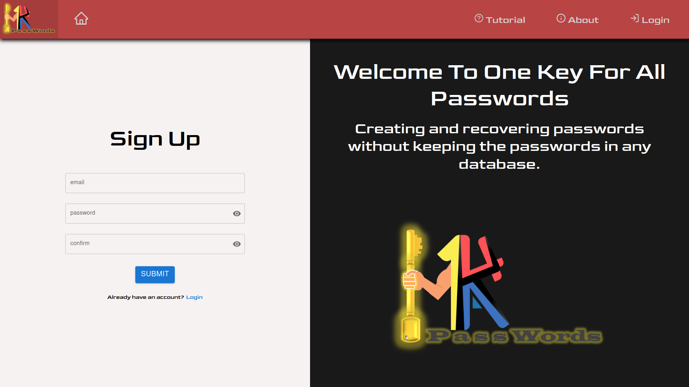
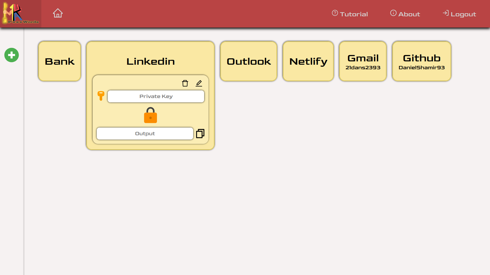

#  One Key For All Passwords

## An app for creating and recovering passwords without saving the passwords in any database.

Over the years we have all signed up for many sites and a large percentage of them we have forgotten their password and now we want to connect to them, or maybe we kept the passwords on a database in a remote place that we have no idea who is responsible for our security, or maybe in a good condition we keep the passwords in a notebook. 

### 1K4A-Passwords will solves those problems for you! 

## :technologist: Languages

- React
- JavaScript
- CSS
- HTML

## :package: Dependencies

- firebase: 9.6.1
- node-sass: 7.0.1
- object-hash: 2.2.0
- react-icons: 4.3.1
- react-redux: 7.2.6
- redux: 4.1.2
- redux-devtools-extension: 2.13.9
- redux-persist: 6.0.0
- redux-thunk: 2.4.1